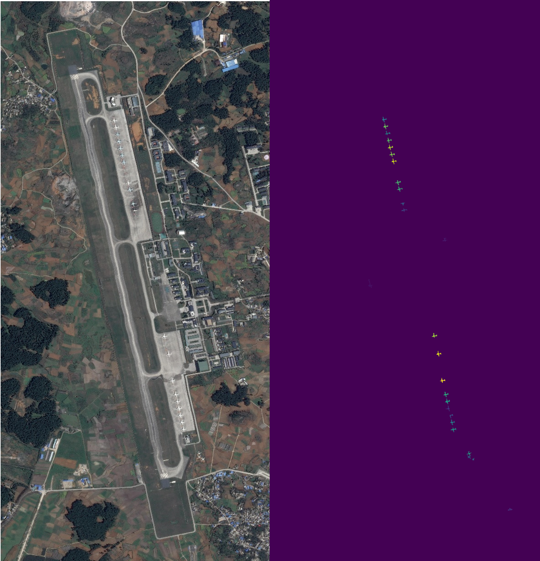

# iSAID plane identify project

## instance segmentation result:


## Environment of running the project:
- Detectron2
- Nvidia Cuda
- Pytorch
- At least 12GB of GPU memory

## Data set resources
https://captain-whu.github.io/iSAID/

## File structure of training:

```
│   Prediction1.png
│   Prediction2.png
│   Prediection3.png
│   Readme.md
│   training_transcript.ipynb
└───data
    │   test.json
    │   train.json
    │   val.json
    ├───test
    ├───train
    └───val
```

# For the detailed info of the project, please see the report